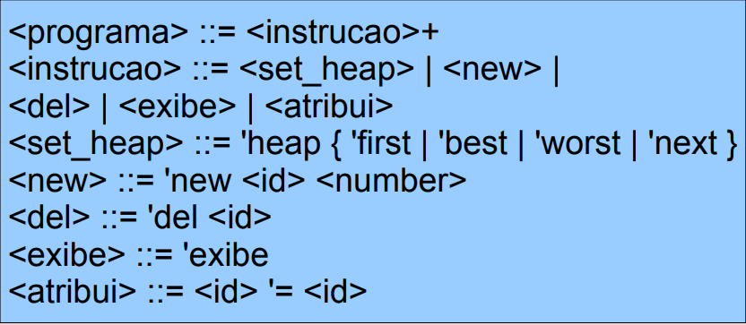
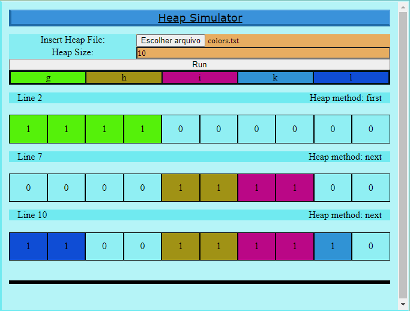

# Heap Simulator

<h2>Proposta</h2>
Um simulador de manipulação de memória de um Heap, criado para a disciplina de Linguagens de Programação (primeiro trabalho de implementação - exercício 2), lecionada pelo professor <a href="https://github.com/carlosbazilio">Carlos Bazilio</a>. 
Tem-se a possibilidade de criar arquivos que designem procedimentos em uma memória heap hipotética, de forma que o criador desses arquivos possa, em diferentes partes de seu código, escolher entre os métodos de inserção (<i>first</i>, <i>next</i>, <i>worst</i> e <i>best fit</i>) e inserir ou apagar diferentes áreas referenciadas por variáveis, assim como visualizar o heap, a qualquer momento, com o comando <code>exibe</code>. O tamanho da memória também pode ser alterado na interface do programa.

<h2>Gramática</h2>
<label> Imagem do slide do professor Carlos Bazilio, presente no <a href="https://github.com/carlosbazilio/trabalho_lp">repositório da proposta dos trabalhos</a>, referenciada por "arquivo".</label>

<h2>Interface</h2>
 

<h3>Sobre Variáveis e Cores</h3>
Cada variável é exposta com uma cor aleatoriamente escolhida durante a leitura do arquivo providenciado, de forma facilitar a sua identificação nos diferentes trechos do heap. A variáveis que apontam para o mesmo trecho são dadas as mesmas cores, o que ocorre quando atribuições são realizadas. 
Próximo ao topo, é possível ver que o nome das variáveis é vinculado às cores correspondentes.
Em casos de atribuições, a variável que recebe um valor é mencionada seguida de parênteses com 'L', com o número da linha onde houve o comando da atribuição. Isso ajuda a distinguir variáveis que possuem o mesmo nome, mas são diferentes, por estarem sendo citadas em diferentes momentos do arquivo. 

<h3>Sobre Configurações na Interface</h3>
<ul>
  <li>
    Para a execução, é necessária a escolha de um arquivo .txt com um conteúdo legível, isto é, que respeite a gramática estipulada. 
  </li>
  <li>É possível alterar o tamanho do heap de acordo com o desejado. O limite estipulado é entre 1 e 20 (incluso). Entretanto, isso é facilmente alterável modificando tal limite no arquivo HTML associado.
  </li>
</ul>

<h3>Sobre a Seção de Erros</h3>
O retângulo cinza ao fim da impressão do heap é onde aparece a seção de erros. É uma ferramenta básica para a análise de problemas, que busca identificar em qual linha do arquivo texto fornecido houve algo não compreendido pelo programa.